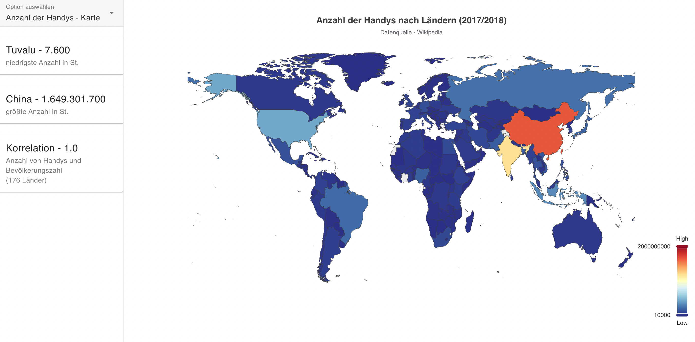

# Visualisation Project

Diese Vorlage soll Ihnen helfen, sich einen Überblick über das Projekt zu verschaffen.

## Project Setup
Zum Start des Projekts müssen folgende Befehle ausgeführt werden:

_1. Erst müssen alle Abhängigkeiten installiert werden:_
```sh
npm install
```

_2. Der Code muss kompiliert werden:_

```sh
npm run dev
```

Nach dem Start lässt sich die Seite unter folgendem Link aufrufen (Localhost): 
<a href="http://localhost:5173/visualisation-project/">Link</a>

## Project Guide
So sieht die erste Seite aus, auf die man beim Afruf der URL-Adresse landet, falls die vorherigen Befehle ausgeführt wurden: \


Die Anwendung besteht aus 4 Seiten, die jeweils eine Art von Diagramm enthalten,
das auf statistischen Daten beruht.  
Alle Grafiken beziehen sich auf das Thema Smartphone-Besitz, und beleuchten es aus verschiedenen Blinkwinkeln.

Der **[Hauptteil](./src/assets/images/MainPart.png)** der Seite wird immer von einer Visualisierung (Landkarte, Balkendiagramm) eingenommen.

Auf der linken Seite, in dem **[Sidebar](./src/assets/images/Sidebar.png)**, werden auf jeder Seite Kennzahlen dargestellt, die Daten aus dem Hauptsatz hervorheben. \
Dazu gehören bspw. _min_ oder _max_ Werte, oder _Korellation_ zwischen zwei Werten (Seite 3 und 4)

Der **[Combobox](./src/assets/images/Combobox.png)** ist dafür vorgesehen, die Seiten zu wechseln.


